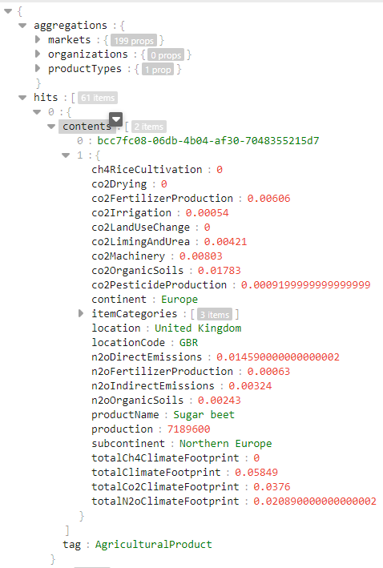
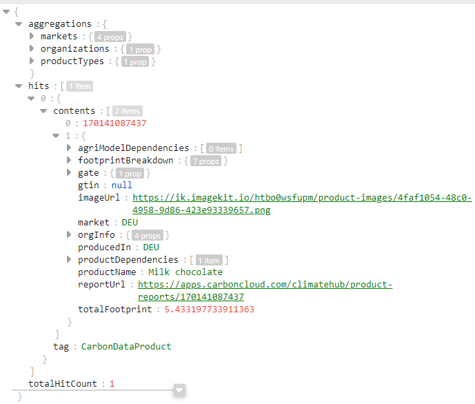
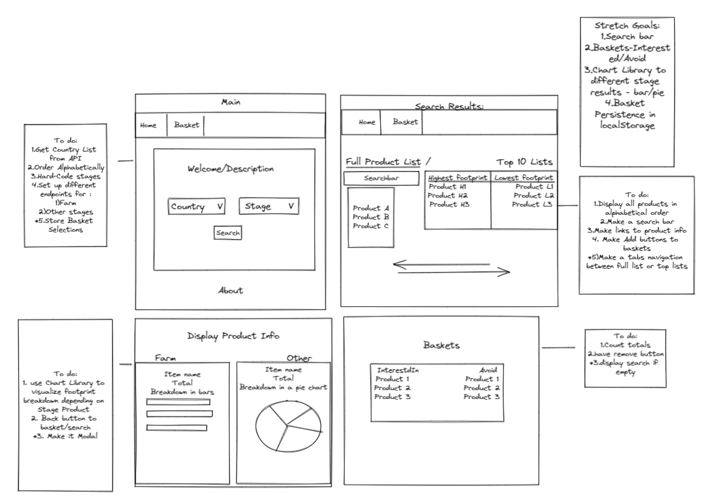
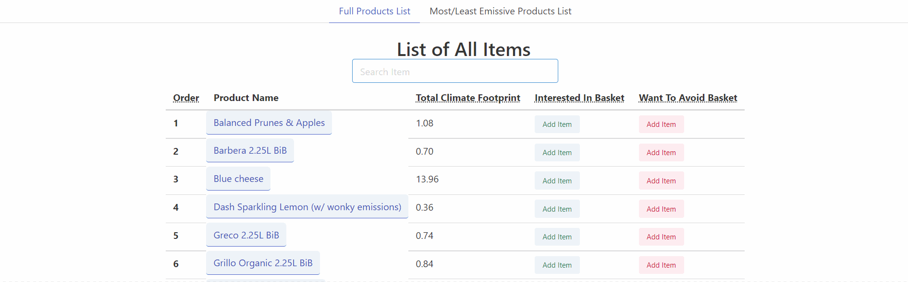

#  GA London React Project-2-What's My Footprint

## TABLE OF CONTENTS

- [Overview](#overview)
  - [Brief](#brief)
  - [Technologies Used](#technologies)
  - [Installation](#installation)
  - [Demo](#demo)
- [Development](#development)
  - [Dropdowns](#dropdowns)
    - [Get Countries Demo](#country-demo)
    - [Get Countries Code Snippet](#country-code)
    - [Stages Dropdown](#stages-dropdown)
  - [Search Request](#search)
    - [Search Demo](#search-demo)
    - [Form](#form)
    - [Search Results](#results)
    - [Farm Search Results](#farm-results)
    - [Other Stages Search Results](#other-results)
  - [Display Data](#data-display)
    - [Tabs](#tabs)
    - [List](#list)
    - [TopLists](#top-lists)
  - [Basket](#basket)
  - [Single Item](#single-item)
    - [Chart](#chart)
    - [Pie](#pie)
- [Styling](#styling)
- [Difficulties and Wins ](#difficulties-wins)
  - [Known bugs](#bugs)
  - [Challenges](#challenges)
- [Future Improvements](#improvements)
- [Key Learnings](#learnings)

## <a name='overview'>Overview</a>

The second project for General Assembly's (GA) Software Engineering Immersive (SEI-Flex) program was to build a React application that consumes a public API.

We have selected [Carbon Cloud API](https://carboncloud.com/climate-footprint-api/) to get products Carbon dioxide equivalent (CO2e). Our application aims to allow users to:

- Display products from various Markets based on the selected production Stage.
- Search for products by name from the rendered list.
- Show Most and Least emissive products from selected categories.
- Add selected products to "Interested In" or "Would like to Avoid" baskets
- Estimate the total impact of products in the baskets.


### <a name='brief'>Brief</a>

The app had to:

* Consume a public API – this could be anything but it must make sense for your project.
* The app should include a router - with several "pages".
* Include wireframes - that you designed before building the app.
* Have semantically clean HTML.
* Be deployed online and accessible to the public.

### <a name='technologies'>Technologies Used</a>

* JavaScript
* React
* React-router-dom
* Bulma
* VSCode
* Git/GitHub
* Insomnia/Postman
* @nivo/bar
* @nivo/pie
* iso-3166-1

### <a name='installation'>Installation</a>

* Clone the repo
* [Request personal Carbon Cloud Api key or use public key for private use.](https://developers.carboncloud.com/)
* Install all frontend packages (from package.json) by running `npm install`
* create `.env` file inside the project directory and list the following line to use demo API key from carboncloud:
`REACT_APP_API_KEY = 95NOSm7wU24EJ3zqf7IN99yFRQkWyhmcThAIwew3` to use project locally, or include API key received from `pi@carboncloud.com`.
* Start server with `npm run start`
### <a name='demo'>Demo</a>

**The app can be viewed [here](https://whatsmyfootprint.netlify.app/).**

## <a name='development'>Development</a>

### <a name='planning-approach'>Planning/Approach</a>

#### <a name='planning'>Planning</a>
Emile has proposed the idea for the project. We have quickly agreed that the project has lots of potential and could be beneficial for users’ general knowledge, rather than just making a practice project showcasing programming skills.
 
 We have spent the first day testing responses by making example API calls, planning, wireframing and applying for a private API key to be able to deploy the application online.
The API had good documentation, but it took some time to get the private key. This was a concern for the first few days, as we wanted to deploy our project online for everyone to use and not have it as a local tool only.

#### <a name='api-search-results'>Example Results from API call</a>

API Returns different data depending if request was to Farm stage or any other stage. Below examples of each API call.



Example of Farm data.




Example of data from all other stages.

#### <a name='wireframe'>WireFraming</a>


#### <a name='approach'>Approach</a>
We used Slack and Zoom to communicate the updates on project and what each person is currently working on.

### <a name='dropdowns'>Dropdowns</a>

#### <a name='country-demo'>Get Countries Demo</a>


#### <a name='country-code'>Get Countries Code Snippet</a>
API returns a nested ISO3 code of available countries from the initial search which will be used to generate future queries for products.

`{"aggregations": {
        "markets": {
            "AFG": 57,
            "AGO": 53,
            "ALB": 85...}}`

 To use it for dropdown we have used `iso-3166-1` library to get the full names of the countries. We have also made a sorting function `iso3SortedList(arr)` to clean up the code, sort it alphabetically and make it more reusable throughout the project.

```
function iso3SortedList(arr){
    const countries = arr.map(item=>{
        const {country:countryName,alpha3:countryCode} = iso.whereAlpha3(item)
        return {countryName,countryCode}
    })
    return countries.sort((current,next)=>current.countryName.localeCompare(next.countryName))
}
```


#### <a name='stages-dropdown'>Stages Dropdown</a>


```
const stages = {
    DistributionCenter: "At Distribution Center",
    Factory:"At Factory",
    Farm:"At Farm",
    StoreShelf:"At Store",
    NoSpecific:"Unspecified"
}

<select onChange={(e)=>{setStageOption(e.target.value)}}>
    <option hidden>Select Stage &#127981;</option>
    {Object.entries(stages).map((stage,i)=>{
        return <option key={i} value={stage[0]}>{stage[1]}</option>
    })}
</select>
```

There are no endpoints for available stages for API calls. Hence we had to hard-code currently supported options and reuse them throughout the project.


### <a name='search'>Search Request</a>

#### <a name='search-demo'>Search Demo</a>


#### <a name='form'>Form</a>

```
<div className="column"><CountryDropdown setMarketCode={setMarketCode}/></div>
<div className="column"><StageDropdown setStageOption={setStageOption}/></div>
```
Renders Market and Stage dropdowns.

```
function displayError(){
    const text = "Please select"
    if(!marketCode&&!stageOption){return <p>{text} Market and Stage</p>} 
    else if(!marketCode){return <p>{text} Market</p>}
    else if(!stageOption){return <p>{text} Stage </p>}
    else return ""
}

```
`displayError` function returns a paragraph or empty string. Apart from displaying missing information for submission it is also used as a validator within `handleSubmitForm`.

```
function handleSubmitForm(e){
    e.preventDefault()
    if(displayError()){return}
    navigate(`/search/market=${marketCode}&stage=${stageOption}`, {state:{market:marketCode,stage:stageOption}});
    }
    ...


{displayError()}
<button onClick={(e)=>{handleSubmitForm(e)}} className=" button is-primary is-small">Check CO2</button>
```

`handleSubmitForm` checks if `displayError` returns a truthy value indicating that there are missing parameters and returns early.
if a falsy value is returned - the form will be "submitted" and navigation to a path with <SearchResults /> will get triggered.


#### <a name='results'>Search Results</a>

```
<Route path={`/search/market=:market&stage=:stage`} element={
<BasketContext.Provider value={[interestedInArr,setInterestedInArr,wantToAvoidArr,setWantToAvoidArr]}>
    <SearchResults/>
</BasketContext.Provider>
} />
```

useContext is used to pass currently selected items to the `<SearchResults/>` element and its children from `<App/>`.

```
market = useLocation().state.market
stage = useLocation().state.stage
```
set market and stage from form submission.

```
if(!market){ market = useParams().market}
if(!stage){ stage = useParams().stage}
```

if no data has been provided via form, take `:market` and `:stage` parameters from URL.


```
const stages = ["DistributionCenter","Factory","StoreShelf","NoSpecific"]
    if(stage==="Farm"){return <FarmResults market={market} stage={stage} />
    } else if(stages.includes(stage)){ return <DisCenterFactoryStoreUnspecifiedResults market={market} stage={stage} />
    }
```
Renders Farm or Other stages depending on the selected stage.
Both components will make requests to `https://api.carboncloud.com/v0/search?q=&market=${market}&gate=${stage}`. However, returned data will differ and will be listed in the next two sections.

#### <a name='farm-results'>Farm Search Results</a>
```
 const arr = hits.map(item=>{
    return {
        id:item._id,
        productName:item._source.productName,
        market:item._source.locationCode,
        totalFootprint:item._source.totalClimateFootprint,
        
        totalCH4Footprint:item._source.totalCh4ClimateFootprint,
        totalN2oFootprint:item._source.totalN2oClimateFootprint,
        totalCo2Footprint:item._source.totalCo2ClimateFootprint,

        co2Breakdown:{
            drying:item._source.co2Drying,
            irrigation: item._source.co2Irrigation,
            farmMachinery: item._source.co2Machinery,
            pesticideProduction: item._source.co2PesticideProduction,
            Deforestation: item._source.co2LandUseChange,
            OrganicSoils: item._source.co2OrganicSoils,
            FertilizerProduction: item._source.co2FertilizerProduction,
        },
        productInfo:`https://apps.carboncloud.com/climatehub/agricultural-reports/benchmarks/${item._id}`
    }})
```
Data collected from requests to Farm Stage

#### <a name='other-results'>Other Stages Search Results</a>
```
const arr = data.hits.hits.map(item=>{
    return {
        id:item._id,
        productName:item._source.productName,
        market:item._source.market,
        totalFootprint:item._source.totalFootprint,
        footprintBreakdown:item._source.footprintBreakdown,
        imageUrl:item._source.imageUrl,
        productInfo:item._source.reportUrl
    }
})
```

### <a name='data-display'>Display Data</a>
Once the data is received from the API it is displayed as a list in a table with the following parameters: `product name`, `climate footprint` and two options: adding items to either `interested in` or `want to avoid` baskets.

#### <a name='tabs'>Tabs</a>

DisplayTabs component checks which Tab should be shown -primary tab with an alphabetical list and a search bar or should "most/least emissive products" be shown side by side.
#### <a name='list'>List</a>
`List` component renders a table visualizing data and enables product allocation to the baskets. Products are being stored in the App component and are passed via useContext hook to all list components.
```
  export const BasketContext = createContext()
  const [interestedInArr,setInterestedInArr] = useState([])
  const [wantToAvoidArr,setWantToAvoidArr] = useState([])

  <Route path={`/search/market=:market&stage=:stage`} element={
            <BasketContext.Provider value={[interestedInArr,setInterestedInArr,wantToAvoidArr,setWantToAvoidArr]}>
              <SearchResults/>
            </BasketContext.Provider>
          } />
 ```


#### <a name='top-lists'>TopLists</a>
`TopPlists` component renders two `List` components side by side and passes up to 10 most or least emissive products from selected category.
```
<div className="columns is-centered">
        <List data={[...data].sort((a,b)=>b.totalFootprint-a.totalFootprint).slice(0,10)} description={"Most Emissive Products"}/>
        <List data={[...data].sort((a,b)=>a.totalFootprint-b.totalFootprint).slice(0,10)} description={"Least Emissive Products"} />
        </div>
```

### <a name='basket'>Basket</a>
If empty - renders search prompt. 

Once either the "Interested In" or "Want to Avoid" basket has at least one product - a table is rendered with all of the items in that basket and the total footprint of the whole basket is counted.

The Basket state is passed via the useContext hook from the App component to avoid prop-drilling.

### <a name='single-item'>Single Item</a>
Depending if the item belongs to the `Farm` stage or `any other stage` - the received data is different hence different component need to be rendered. 

#### <a name='chart'>Chart</a>

We have decided to visualize `Farm` Items as a bar component as it has more detailed breakdown of different stages of production.
Also, every country has at least one Farm item listed.

#### <a name='pie'>Pie</a>

products from `Other Stages` of production are listed in a pie component, as they only got `total climate footprint` and breakdown of how different stages of production contribute to the footprint.
### <a name='styling'>Styling</a>
The project has been styled with CSS library [Bulma](https://bulma.io/). It is very lightweight and easily customizable - it allowed us to make a responsive website focused on functionality in a very short time span.

## <a name='difficulties-wins'>Difficulties and Wins</a>

### <a name='bugs'>Known Bugs</a>
- <s>Basket total footprint accumulator count</s>

- <s>Back button returning to the main search area, rather than previously generated query</s>

- <s>Being able to add items to both baskets</s>

-If the country does not have any products listed in stage selection and a user wants to select another stage without repeatedly selecting the same country - he will get the same notification on data unavailable to the initial stage request, rather than tailored to the new stage selection.

Found a bug? Please report it to @zanasmakarov@gmail.com

### <a name='challenges'>Challenges and Wins</a>
- Filtering search list. Some markets at Farm stage can return lots of results. To filter them - search bar was introduced.<br>
```
function filterSearchResults(arrItemArg,searchTermArg){
    const searchTerm = searchTermArg.trim().toLowerCase()
    const arrItem = arrItemArg.toLowerCase()
    if(!searchTerm) return arrItem
    return searchTerm&&arrItem.includes(searchTerm)
}
```

- Only selected countries have products from certain stages.<br>
`At Distribution Center` only has data for Belgium, Netherlands, Sweden and United Kingdom.<br>
`At Factory` only has data for Austria, Germany, Italy and Switzerland.<br>
`At Store` only has data for 20 countries - all from West-oriented countries - EU/US/Australia/NZ.
-`Unspecified` only has data for 19 countries - mostly from European countries, but has slightly bit more Asian countries than `At Store`<br><br>
To fix the issue of "no data fetched" we have saved response data and suggested making a new query, or selecting only countries that have an available stage options.<br>
```
setAvailableMarkets(iso3SortedList(Object.keys(data.aggregations.markets)))
...
 if(data.length<1){

        return <NoCountryData stage={stage} market={market} availableMarkets={availableMarkets} />
    }
```
- Allowing items to be added only to one of the baskets, but not both.
```
function makeAddRemoveButtons(arr,setArr,styling,anotherBasketArr){
        return (anotherBasketArr.some(element=>element.id==item.id)) ?
        <button className="button is-small" title="Item in another basket" disabled>Unavailable</button>
        : checkContextArr(arr) ?
        <button className={`button is-small is-${styling} is-light`} onClick={()=>{handleAdding(arr,setArr)}}>Add Item</button> 
        : <button className="button is-small is-warning is-light" onClick={()=>{handleRemoving(arr,setArr)}}>Remove Item</button>
        
    }
```


## <a name='improvements'>Future Improvements</a>
- Improve visualization on bar component @`Farm Item`.
- Save current basket items to localStorage if application does not have users, or database if one exists.

## <a name='learnings'>Key Learnings</a>

- This was my first time working with production-ready API rather than educational APIs. The project was more complex in terms of setup and reading nested data.

- The API has already had structural changes once, which made us refactor the project slightly - it taught us of the importance of code maintenance throughout the project lifespan.

- It was a very good experience to work on a project in a pair as we practised task delegation, working on shared ideas and taking them further.

- Learned to work with data visualization library and new CSS framework never used before.

- Was really proud of using useContext hook, which I always imagined being very difficult to implement - it made code more readable and avoided prop-drilling.

- It took a while for us to get API key, which was worrying as we wanted to deploy our application rather than making it local only.


